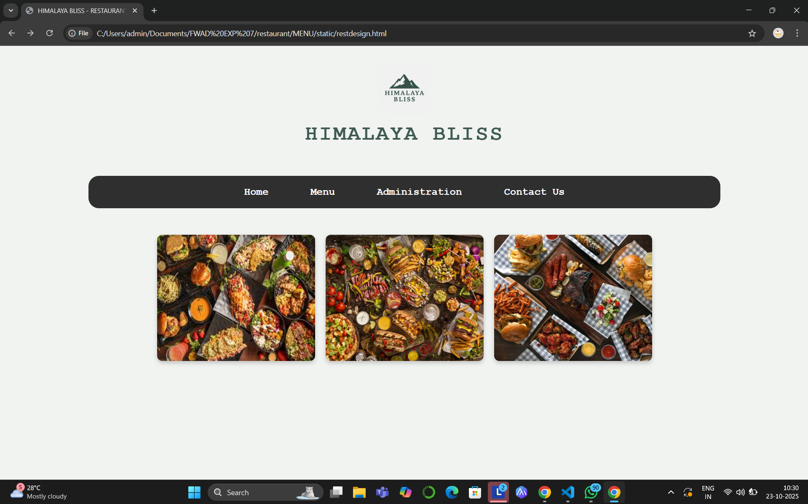

# Ex.07 Restuarant Website
## Date:
23-10-2025
## AIM:
To develop a static Resturant website to display the menu and services provided by the resturant.

## DESIGN STEPS:

### Step 1:
Requirement collection.

### Step 2:
Creating the layout using HTML and CSS.

### Step 3:
Updating the sample content.

### Step 4:
Choose the appropriate style and color scheme.

### Step 5:
Validate the layout in various browsers.

### Step 6:
Validate the HTML code.

### Step 7:
Publish the website in the given URL.

## PROGRAM:
## FOR LOOKPAGE(restdesign.html):
    <!DOCTYPE html>
    <html lang="en">
    <head>
        <meta charset="UTF-8">
        <meta name="viewport" content="width=device-width, initial-scale=1.0">
        <title>HIMALAYA BLISS - RESTAURANT DESIGN</title>
        
    </head>
    <body>

        

            
            <h1>HIMALAYA BLISS</h1>
        

        <nav>
            <a href="home.html">Home</a>
            <a href="menus1.html">Menu</a>
            <a href="admins1.html">Administration</a>
            <a href="contact.html">Contact Us</a>
        </nav>
        
        

        

            
            
            
        

    </body>
    </html>

## FOR HOMEPAGE(home.html):
    <!DOCTYPE html>
    <html lang="en">
    <head>
        <meta charset="UTF-8">
        <meta name="viewport" content="width=device-width, initial-scale=1.0">
        <title>Restaurant Home Section</title>
        
    </head>
    <body>

        

            

                <h2 class="card-title">Our New Menu</h2>
                

                     

                

                    
Explore our latest culinary creations! Our chefs have curated a selection of dishes using the freshest seasonal ingredients, promising a delightful dining experience for every palate.

                    <a href="menus1.html" class="card-link">See our menu</a>
                

            

            

                <h2 class="card-title">Book a Table</h2>
                

                     

                

                    
Reserve your spot for an unforgettable dining experience. Fill out the form below and we'll confirm your booking shortly.

                    <form action="#" method="POST">
                        

                            <label for="booking-name">Your Name:</label>
                            <input type="text" id="booking-name" name="name" required>
                        

                        

                            <label for="booking-date">Date:</label>
                            <input type="date" id="booking-date" name="date" required>
                        

                        

                            <label for="booking-time">Time:</label>
                            <input type="time" id="booking-time" name="time" required>
                        

                        

                            <label for="booking-guests">Number of Guests:</label>
                            <input type="number" id="booking-guests" name="guests" min="1" max="10" value="2" required>
                        

                        

                            <input type="submit" value="Book your table now">
                        

                    </form>
                

            

            

                <h2 class="card-title">Opening Hours</h2>
                

                     

                

                    
Plan your visit to our restaurant. We look forward to serving you our finest dishes during these hours:

                    <ul class="opening-hours-list">
                        <li><strong>Mon - Fri:</strong> 2pm - 10pm</li>
                        <li><strong>Sat:</strong> 2pm - 11pm</li>
                        <li><strong>Sun:</strong> 2pm - 9pm</li>
                    </ul>
                    

            

        

    </body>
    </html>

## FOR MENUPAGE(menus1.html):
    <!DOCTYPE html>
    <html lang="en">
    <head>
        <meta charset="UTF-8">
        <meta name="viewport" content="width=device-width, initial-scale=1.0">
        <title>Restaurant Food Menu</title>
        
    </head>
    <body>
        

            

                

                    

                        <strong>HIMALAYABLISS</strong> 
                        Restaurant of Heaven
                    

                    <h1>Menu</h1>
                

                

                    

                        

                            <h2>Appetizers</h2>
                            

                                

                                    Caprese Skewers
                                    $15.00
                                

                                
Fresh mozzarella, cherry tomatoes, and basil, drizzled with balsamic glaze.

                            

                            

                                

                                    Spicy Chicken Wings
                                    $20.00
                                

                                
Crispy wings tossed in a fiery house-made sauce, served with blue cheese dip.

                            

                            

                                

                                    Vegetable Samosa
                                    $10.00
                                

                                
Savory pastry filled with spiced potatoes and peas, served with mint chutney.

                            

                            

                                

                                    MUTTON 65
                                    $4.00
                                

                                
Spicy, deep-fried boneless mutton pieces, a Southern Indian delicacy.

                            

                            

                                

                                    Tomato Soup
                                    $10.00
                                

                                
Creamy roasted tomato soup, served with herbed croutons.

                            

                        

                        

                            <h2>Salads</h2>
                            

                                

                                    Quinoa Salad
                                    $10.00
                                

                                
Healthy quinoa with mixed greens, cranberries, and a citrus vinaigrette.

                            

                            

                                

                                    Spinach Salad
                                    $20.00
                                

                                
Fresh spinach, strawberries, candied pecans, and poppy seed dressing.

                            

                            

                                

                                    Eggplant Salad
                                    $30.00
                                

                                
Grilled eggplant, roasted bell peppers, and feta cheese with a lemon-herb dressing.

                            

                            

                                

                                    Chicken Salad
                                    $50.00
                                

                                
Grilled chicken, crisp lettuce, tomatoes, and cucumber with a creamy dressing.

                            

                            

                                

                                    Green Salad
                                    $40.00
                                

                                
Mixed seasonal greens with a light vinaigrette.

                            

                            

                                

                                    Pasta Salad
                                    $60.00
                                

                                
Tricolor pasta, fresh vegetables, and Italian dressing.

                            

                        

                    

                    

                        

                            <h2>Main Courses</h2>
                            

                                

                                    Beef Stir-Fry
                                    $20.00
                                

                                
Tender beef strips, crisp vegetables, and savory stir-fry sauce, served with rice.

                            

                            

                                

                                    Shrimp Tacos
                                    $10.00
                                

                                
Grilled shrimp, fresh slaw, and spicy crema in soft tortillas.

                            

                            

                                

                                    Mushroom Risotto
                                    $25.00
                                

                                
Creamy Arborio rice with wild mushrooms, parmesan, and truffle oil.

                            

                            

                                

                                    Chicken Fried Rice
                                    $30.00
                                

                                
Classic fried rice with tender chicken, eggs, and mixed vegetables.

                            

                            

                                

                                    Eggplant Parmesan
                                    $40.00
                                

                                
Layers of breaded eggplant, rich marinara, and melted mozzarella.

                            

                        

                        

                            <h2>Desserts</h2>
                            

                                

                                    Tiramisu
                                    $7.00
                                

                                
Classic Italian coffee-flavored dessert with mascarpone cheese.

                            

                            

                                

                                    Fruit Tart
                                    $5.00
                                

                                
Fresh seasonal fruits atop a sweet pastry cream in a crisp tart shell.

                            

                            

                                

                                    CheeseCake
                                    $10.00
                                

                                
Creamy New York style cheesecake with a graham cracker crust.

                            

                            

                                

                                    Apple Pie
                                    $9.00
                                

                                
Warm apple pie with a flaky crust, served with a scoop of vanilla ice cream.

                            

                            

                                

                                    Chocolate Lava Cake
                                    $8.00
                                

                                
Decadent molten chocolate cake, served with a berry coulis.

                            

                        

                    

                

                
                

                    
www.himalayabliss.com

                

            

        

    </body>
    </html>

## FOR ADMINISTRATION PAGE(admins1.html):
    <!DOCTYPE html>
    <html lang="en">
    <head>
        <meta charset="UTF-8">
        <meta name="viewport" content="width=device-width, initial-scale=1.0">
        <title>Administration & Collaborators</title>
        
    </head>
    <body>
        <h1 class="section-title">Administration & Collaborators</h1>

        

            
            

                

                    

                        
                    

                    
Mark Zuckerberg

                

                

                    Chief Strategist
                

                

                    **Details:** Mr. Zuckerberg provides executive oversight on global platform integration and guides our long-term vision for community engagement and digital strategy.
                

            

            

                

                    

                        
                    

                    
Bill Gates

                

                

                    Lead Technology Advisor
                

                

                    **Details:** Mr. Gates focuses on leveraging emerging technologies to enhance our operational efficiency and supports our initiatives in sustainable growth and resource management.
                

            

            

                

                    

                        
                    

                    
Jeff Bezos

                

                

                    E-commerce & Logistics Partner
                

                

                    **Details:** Mr. Bezos collaborates on optimizing supply chain logistics and scaling operations across vast geographical markets with high-volume precision and reliability.
                

            

            
            

                

                    

                        
                    

                    
Veshwanth R

                

                

                    Founder and CEO
                

                

                    **Details:** Founder and CEO of the restaurant HIMALAYA BLISS provides a fine dining restaurant as in top of the Multi-Cuisine Restaurant.
                

            

            

                

                    

                        
                    

                    
Joel Austin

                

                

                    Head of Finance
                

                

                    **Details:** Responsible for all financial planning, reporting, and investor relations, ensuring robust fiscal health and transparency.
                

            

            
        

    </body>
    </html>

## FOR CONTACTPAGE(contact.html):
    <!DOCTYPE html>
    <html lang="en">
    <head>
        <meta charset="UTF-8">
        <meta name="viewport" content="width=device-width, initial-scale=1.0">
        <title>Contact Us - Modern Layout</title>
        <link rel="stylesheet" href="https://cdnjs.cloudflare.com/ajax/libs/font-awesome/6.0.0-beta3/css/all.min.css">
        
        
    </head>
    <body>
        

            

                <h1>Contact Us</h1>
                
For inquiries regarding **Food Quality, Hygiene, Sanitation, or Facility Maintenance**, please use the form below. We prioritize maintaining the highest standards of safety and operational excellence.

            

            

                

                    

                        
<i class="fas fa-home"></i>

                        

                            <h3>Address</h3>
                            
4871 Sugar Campcross Road, Owatonna, Minnesota, 55060

                        

                    

                    

                        
<i class="fas fa-phone-alt"></i>

                        

                            <h3>Phone</h3>
                            
561-456-2321

                        

                    

                    

                        
<i class="fas fa-envelope"></i>

                        

                            <h3>Email</h3>
                            
himalayasbliss3@gmail.com

                        

                    

                

                

                    

                        <h2>Send Message</h2>
                        <form>
                            

                                <input type="text" id="fullName" placeholder="Full Name">
                            

                            

                                <input type="email" id="email" placeholder="Email">
                            

                            

                                <textarea id="message" placeholder="Type your Message..." rows="5"></textarea>
                            

                            <button type="submit" class="send-button">Send</button>
                        </form>
                    

                

            

        

    </body>
    </html>
## OUTPUT:
## FOR LOOKPAGE(restdesign.html):

## FOR HOMEPAGE(home.html):

## FOR MENUPAGE(menus1.html):

## FOR ADMINISTRATION PAGE(admins1.html):

## FOR CONTACTPAGE(contact.html):

## RESULT:
The program for designing software company website using HTML and CSS is completed successfully.
